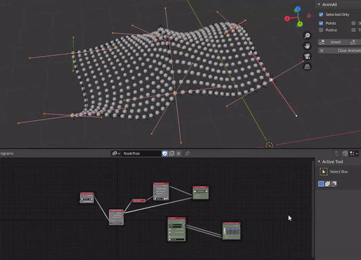
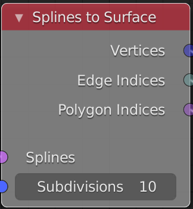
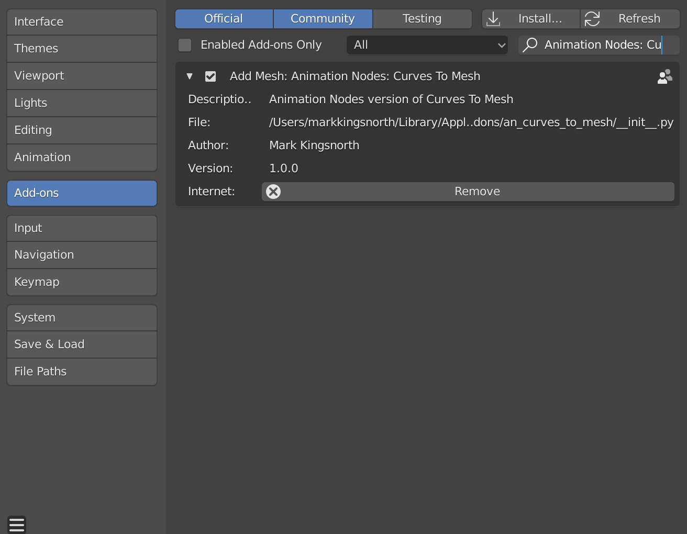
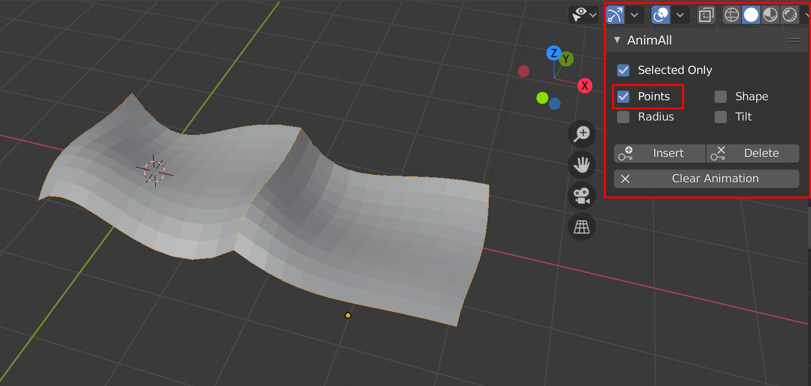
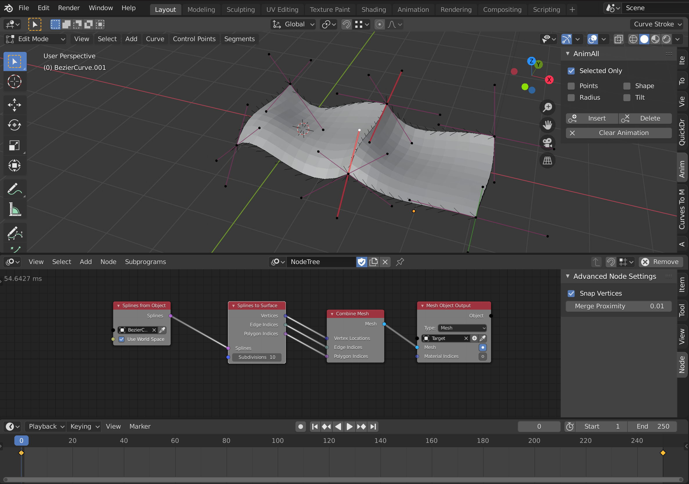
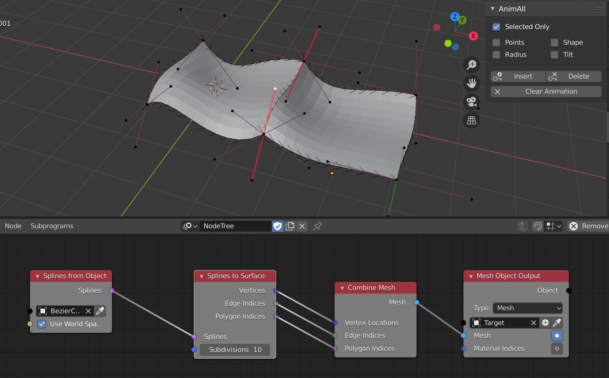

.. _animation_nodes:

###########################
Animation Nodes Version
###########################

.. note::

   This Animation Nodes version is soon to be deprecated in favor a new Geometry Nodes version.

   This is an optional add-on that extends the functionality of the main Curves To Mesh add-on. It is not required for the main functionality of the Curves To Mesh add-on, but it does provide additional features for animating and dynamically modifying quad curve surfaces.

There is also the option to use the add-on as a node in the `Animation Nodes <https://animation-nodes.com/>`_ Blender extension. This is useful if you want to either create animated effects, or control the effect dynamically as an alternative to the preview mode. 

The node is called 'Splines to Surface' and looks like this:

Installation
========================

**With animation_nodes_curves_to_mesh.zip:**

#. Make sure you have installed the latest version of Animation Nodes available here: `https://animation-nodes.com/#download  <https://animation-nodes.com/#download>`_.
#. Make sure you have installed the main Curves To Mesh addon as above.
#. In Blender, Go to *Edit -> Preferences*.
#. Select the *Install...* button along the top.
#. This will open a file dialog where you should navigate to where you have downloaded the zip file.  This file should not be unzipped.
#. Then, click the "Install add-on from file" button.
#. Search for the add-on by typing "Animation Nodes: Curves To Mesh" in the search box if it does not already appear.
#. Make sure the checkbox next to the Add-on (*Add Mesh: Animation Nodes: Curves To Mesh*) is ticked.
#. The nodes are described below and have the same parameters as the main add-on.

.. tip::

   To animate bezier curve points, you will need to activate the `AnimAll <https://blender-addons.org/animall-addon/>`_ add-on which comes already bundled with Blender.

   .. image:: _static/images/animall.png
      :alt: AnimAll Installation

...you can then add key frames to bezier points by selecting the curve and making sure that the 'Points' checkbox is selected in the tools panel:

How to Use
========================

It has the following main inputs:

* **Splines**: The set of splines to operate on which can be supplied from the Splines from Object node.
* **Subdivisions**: The amount of subdivisions to divide the resulting quad patched by.

An example nodes set up is shown which is also included in **animation_nodes_samples.zip**:

