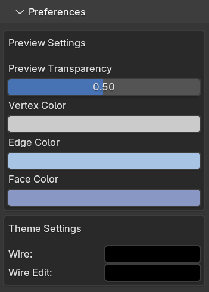

###################################
Using the Control Panel
###################################

The add-on has a set of parameters in Blender's parameter toolbar on the right hand side.  If you do not see the toolbar, try pressing 'N'.  Select the "Curves To Mesh" tab.

.. _preview_mode:

Preview
========================

The add-on provides a preview mode that allows you to see the generated mesh in real-time as you adjust the curve parameters.  This can be particularly useful for fine-tuning the shape and appearance of the final mesh before committing to the conversion process.

Click the *Enable* and *Disable* buttons to toggle the preview mode on and off.  When enabled, the display will update dynamically as you modify the curves.

   
.. note::
   
   The preview mode is computationally intensive, especially for complex curves.  If you experience performance issues, consider disabling the preview mode while making significant adjustments to the curves.

   The preview mode will update only after points have been moved or adjusted to save on performance.

Collection to Operate On
========================

By default, the addon will operate on curves in Blender's default Collection, helpfully named "Collection".  If you wish to manage the curves separately, you can add them to a different collection and select that collection from the tool's options.

Conversion Method
========================

You can choose different ways to convert curves to a mesh, depending on how they are arranged:

Surface to Mesh
----------------------

For converting a network of 4 curves into a quad-based surface. Create a mesh between sets of four interlocking curves:

   .. image:: _static/images/surface_to_mesh.png
      :align: center
      :width: 600px
      :alt: Surface to Mesh

.. tip::

    :ref:`See here<create_patches>` for how to create the curves for this mode.

Options
^^^^^^^^^^^^^^^^^^^^

* **Across**: The number of cuts across a mesh surface.
* **Down**: The number of cuts down a mesh surface (only available when 2 or 4 curves are selected)
* **Use Curve Resolution**: If checked, Instead of using the subdivision options, use the curve's resolution_u setting found under the standard curve options panel.  This is useful for controlling the individual subdivisions on a more complex surface.
* **Surface Creation**: 
    * **Check Direction of Curve**: If selected, Check direction of curve will only create surfaces based on the direction of a curve.  Only cyclic 2x2 curves will have surfaces created.  Useful for enforcing a particular way of creating curves, such as when a cylinder has ambiguous 2x2 curves:

        .. image:: _static/images/c2m_4.gif
            :alt: Surface Creation
            :width: 600px

Profiles to Mesh
----------------------

For lofting shapes by defining a series of curve cross-sections.

    .. image:: _static/images/profiles_to_mesh.png
        :align: center
        :width: 600px
        :alt: Profiles to Mesh

Options
^^^^^^^^^^^^^^^^^^^^

* **Curve Subdivisions**: The number of cuts per cross section curve.
* **Bridging Subdivisions**: The number of cuts between the cross sections.
* **Use Curve Resolution**: If checked, Instead of using the subdivision options, use the curve's resolution_u setting found under the standard curve options panel.  This is useful for controlling the individual subdivisions on a more complex surface.
* **Twist**: Similar to how the twist parameter is used in the standard Bridge Edge Loops in Blender, this will control which vertices in both loops are connected to each other.
* **Bridge Ordering**: This controls the order in which the curves are joined together:
   * **Position**: By default, the curves will be bridged by how close they are to one another:

    .. image:: _static/images/bridge_opn_position.png
        :alt: Bridge Position
        :width: 600px

   * **Curve Name**: The curves will be joined in alphabetic order, so you can control which order the curves are joined by their name.  Here the first bridge occurs at the center curve because it's name is 'Bezier Circle 1':
    
    .. image:: _static/images/bridge_opn_name.png
        :alt: Bridge Name
        :width: 600px
        
    * **Reversed**: When ordering by Curve Name, this reverses the order of the curves, in case the results appear incorrect (a minor Blender bug).

* **Smoothing**:

   * **Smooth Type**: This controls the smoothness of transition between the curves.  The Surface type in particular will create a smoother transition.

    .. image:: _static/images/smooth_type.png
        :alt: Smooth Type
        :width: 600px

   * **Smoothness**: This is the amount of smoothing factor to apply to the algorithm.

* **Profile**
   * **Profile Shape**: Shape transition factor for the cross section profiles.

    .. image:: _static/images/profile_shape.png
        :alt: Profile Shape
        :width: 600px

   * **Profile Type**: The type of profile interpolation used.  This can give a range of different effects:

    .. image:: _static/images/profile_type.png
        :alt: Profile Type
        :width: 600px

Sweep to Mesh
----------------------

For sweeping one or more profile curves along a guiding path to build custom 3D forms.

    .. image:: _static/images/c2m_sweep-1.jpg
        :align: center
        :width: 600px
        :alt: Sweep to Mesh

    .. image:: _static/images/c2m_sweep-2.jpg
        :align: center
        :width: 600px
        :alt: Sweep to Mesh

    .. image:: _static/images/c2m_sweep-3.jpg
        :align: center
        :width: 600px
        :alt: Sweep to Mesh

    .. image:: _static/images/c2m_sweep-4.jpg
        :align: center
        :width: 600px
        :alt: Sweep to Mesh

Options
^^^^^^^^^^^^^^^^^^^^

* **Sweep Curve**: This is the main curve for controlling the deformation between cross sections. You can either select the curve from the drop down box or use the eye dropper tool.
* **Subdivisions**: This is the number of subdivisions for the sweep curve, controlling how many subdivisions between the cross sections.
* **Accuracy**: This controls the level of accuracy for when cross sections are placed on the curve.  Higher values will increase accuracy at the expense of compute time. The default setting should suffice and does not need to be changed.
* **Cross Sections**: The cross sections are taken from Collection to operate on. The subdivisions setting controls the number of subdivisions on each curve cross section.
* **Use Curve Resolution**: If checked, Instead of using the subdivision options, use the curve's resolution_u setting found under the standard curve options panel.
* **Twist**: This will twist the profile curve by a number of degress.  Different to the "Profiles to Mesh" setting, this can twist in multiples of 360 degress to produce extreme amounts of twist, allowing you to fashion twisted cables and rings.

    .. image:: _static/images/sweep_twist.png
       :alt: Sweep Twist
       :width: 600px

Mesh Settings
========================

These control how the mesh will be created:

* **Snap to control point**: This option will move the vertex to it's nearest control point if it has one.  Useful for maintaining shapes:

    .. image:: _static/images/c2m_snap.gif
        :alt: Snap to Control Point
        :width: 600px

* **Mirror X/Y/Z**: Select whether you wish the created mesh to be mirrored along the global X, Y and/or Z coordinates.
* **Flip Normals**: Flip the faces of the mesh.
* **Shade Smooth**: Apply smooth shading to the faces of a mesh.
* **Show All Edges**: When creating a mesh, all the edges will be shown in the wireframe view.
* **Show Wire**: The full wireframe will be show even in Solid view mode.

.. tip::

   Show All Edges and Show Wire can be turned on or off later under the Object panel:

    .. image:: _static/images/viewport_display.png
        :alt: Show Wire
        :width: 600px

.. _create_mesh:

Create Mesh
========================

When you are happy you can create the mesh by pressing the 'Create Mesh' button, or by pressing Alt-Enter by default.
    

Other Panels
========================

Curve Editing
-------------------------

.. note::

   This feature is only available when in *Curve Edit Mode*.

When in Blender's *Curve Edit Mode*, The add-on provides a set of tools for quickly displaying and editing curves directly within the control panel.  These tools allow you to quickly modify the curves without needing to switch to the standard curve editing mode.

Display handles
^^^^^^^^^^^^^^^^^^^^
This will control display the handles of the curves in the viewport:

* **None/Selected/All**: This will control whether the handles are displayed for selected points, all points or not at all.
* **Show Curve Direction**: This will display the direction of the curve in the viewport, which can be useful when creating surface patches according to curve direction (see "Check Direction of Curve").

Curve Editing Tools
^^^^^^^^^^^^^^^^^^^^

These built in Blender tools are here for convenience allow you to quickly edit the curves.

Preferences
-------------------------

You can alter the colours of the preview mesh in the preferences panel.

Advanced Parameters
----------------------

Vertex Settings
^^^^^^^^^^^^^^^^^^^

These controls how mesh vertices are created and distributed.  It is best left untouched unless you are having some issues with accuracy at smaller or larger scales.  :ref:`Contact us <contact>` if you are having any issues.

Nudges/Samples/Definition:
"""""""""""""""""""""""""""""

These parameters do not normally need to be changed. They control how the vertices get distributed along a curve.  It is a non-trivial maths problem to evenly distribute the vertices, as the nature of a Bezier curve is designed to put more vertices along more pronounced part of it.  The add-on distributes the vertices along the curve by nudging them along for a set number of times, attempting to make the vertices equally spaced each time.

* **Nudges**: number of times each vertex is nudges along the curve.  Note: By setting the parameter to zero, vertices will be distributed in a more Bezier like fashion.
* **Samples**: Number of samples between vertices to nudge them along by.
* **Definition**: How well a point is calculated on a Bezier curve.

Remove Double Precision:
"""""""""""""""""""""""""""""

This controls the how close to vertices need to be in order to be merged.  Particularly with Surface to Mesh mode, vertices are merged along the edges between curves.

Curve Connections
^^^^^^^^^^^^^^^^^^^^^^^^

**Decimal places to round to**: When calculating the curve intersections, the add-on temporarily rounds the corner coordinated so it can easily find nearby curves.  Increasing this parameter will increase the decimal points to corners are rounded to.  Increasing this value may be helpful when there are many points that are very close togehter.

