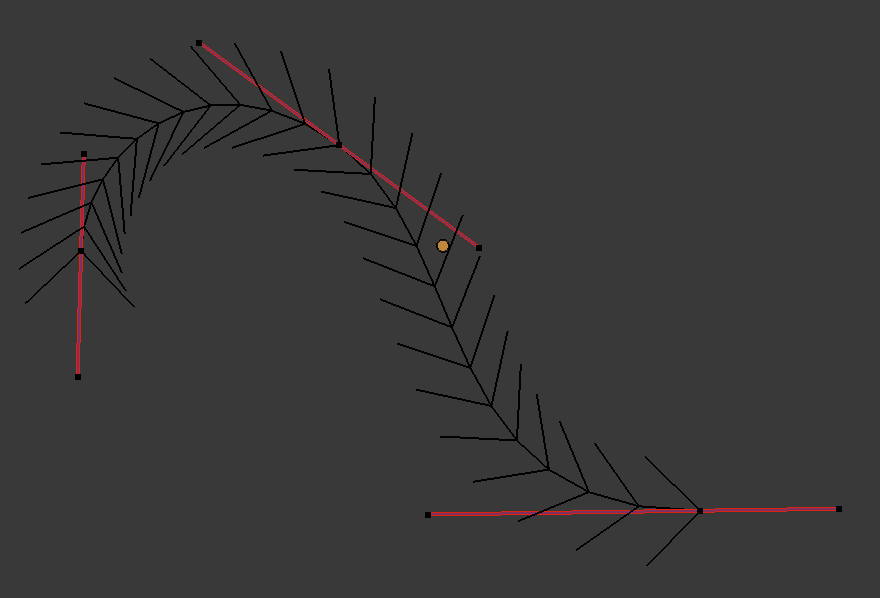
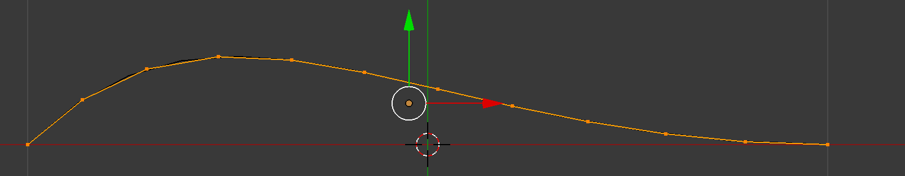

######################
How it Works
######################

The add-on works on **Bezier Curves**.  That is, curves that have control handles along them:

The add-on works by automatically:

#. Creating a set of evenly distributed vertices and edges along the curve(s) you have selected to create an edge loop.

#. Then the edge loops will be joined using either a `Grid Fill <https://docs.blender.org/manual/en/latest/modeling/meshes/editing/face/grid_fill.html>`_ ("Surface to Mesh") or `Bridge Edge Loops <https://docs.blender.org/manual/en/latest/modeling/meshes/editing/edge/bridge_edge_loops.html>`_ ("Profiles to Mesh" or "Sweep to Mesh") or operation.

How the vertices are distributed
====================================================

The add-on distributes the vertices evenly along the curve.  This ensures that, when creating a surface, the vertices are connected across edges as smoothly as possible.

This is different from the standard Blender conversion of curves to mesh objects which does not distribute vertices evenly.  The distribution algorithm nudges the vertices along the curve until they are equally distanced from one another.

This feature does have a performance impact on more complex curves - to disable the feature, set the *nudges* parameter to 0 in the *Advanced* panel.