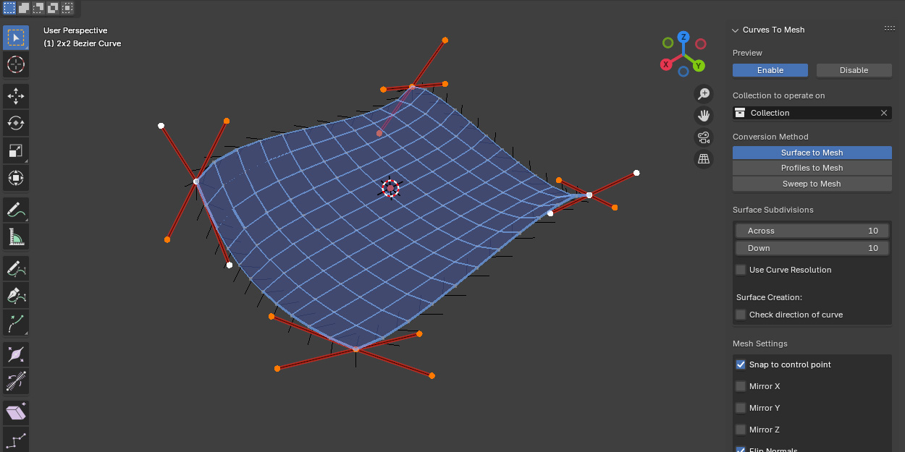

.. Curves to Mesh documentation master file, created by
   sphinx-quickstart on Tue Jun  3 13:03:21 2025.
   You can adapt this file completely to your liking, but it should at least
   contain the root `toctree` directive.

Curves to Mesh
==========================================

**************************
What is Curves to Mesh?
**************************

`Curves to Mesh <https://blendermarket.com/products/curves-to-mesh/?ref-361>`_ is an add-on for 3D modellers who want to create mesh surfaces from a network of bezier curves.  Once created, these can then be used alongside Blender's core modelling tools to create more complex shapes..

Workflow
==================

#. Create a set of bezier curves in Blender.  The add-on offers three modes for converting curves into mesh geometry:

    * **Surface to Mesh**: :ref:`Connect networks of 4 curves<create_patches>` to generate quad-based 3D surfaces.

        .. image:: ./_static/images/patches.gif
           :align: center
           :width: 600px
           :alt: Surface to Mesh

    * **Profiles to Mesh**: Loft shapes by defining a series of curve cross-sections.

        .. image:: ./_static/images/profiles.gif
           :align: center
           :width: 600px
           :alt: Profiles to Mesh
  
    * **Sweep to Mesh**: Sweep one or more profile curves along a guiding path to build custom 3D forms.

        .. image:: ./_static/images/sweep.gif
           :align: center
           :width: 600px
           :alt: Sweep to Mesh

#. Preview the mesh in real-time as you edit the curves.
#. Convert the curves into a normal Blender mesh surface.
#. Use this regular mesh surface like any other alongside Blender's traditional mesh modelling techniques to create more complex objects for export or rendering.

Compatible with my other popular add-ons such as `Flowify <https://blendermarket.com/products/flowify/?ref-361>`_, `Quad Maker <https://blendermarket.com/products/quad-maker/?ref-361>`_ and `Conform Object <https://blendermarket.com/products/conform-object/?ref-361>`_.

.. toctree::
   :maxdepth: 2
   :caption: Contents:

   installation
   quick_start
   control_panel
   how_it_works
   animation_nodes
   troubleshooting
   contact

