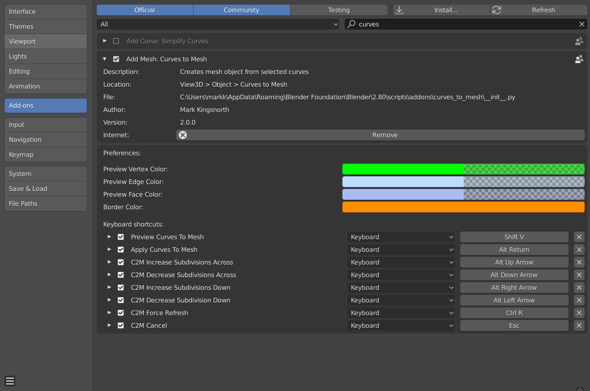

.. _installation:

#############
Installation
#############

.. note::

   If you have any issues do not hesitate to get in touch via `info@configurate.net <mailto:info@configurate.net>`_.

You will be provided with the following files:

* **curves_to_mesh.zip** - the main add-on file (do not unzip).
* **samples.zip** - a set of example files for the main add-on.
* **animation_nodes_curves_to_mesh.zip** - an extension add-on for :ref:`animation nodes <animation_nodes>` (do not unzip).
* **animation_nodes_samples.zip** - A set of sample.blend files demonstrating the :ref:`animation node setup <animation_nodes>`.

Instructions for how to install the add-on and additional features are below.

Main Add-on Installation
========================

Blender 4.2 and Above
----------------------------

.. image:: _static/images/installation.gif
   :alt: Installation

Drag and drop the installation zip file into Blender to install the add-on.  

You can then follow the steps in the :ref:`Getting Started Guide<quick_start>`.

Previous Blender Versions
----------------------------

The add-on can be installed through the Blender UI:

#. Go to *Edit -> Preferences*.

#. Select the *Add-ons* tab on the left it is not already.

#. Select the *Install...* button along the top.

#. This will open a file dialog where you should navigate to where you have downloaded the "Curves To Mesh" zip file.  This file should not be unzipped.

#. Then, click the "Install add-on from file" button.

#. Search for the add-on by typing "Curves to Mesh" in the search box if it does not already appear. 

#. Make sure the checkbox next to the Add-on (*Add Mesh: Curves to Mesh*) is ticked.

#. Next, search for the name "Curves To Mesh" in the search bar.  You should see the add-on entry under "Add Mesh: Curves to Mesh".

#. Check the checkbox for this entry.  

#. The options that appear under the entry allow you to change the colours of the Preview Mode, as well as change the keyboard shortcuts relating to the tool.